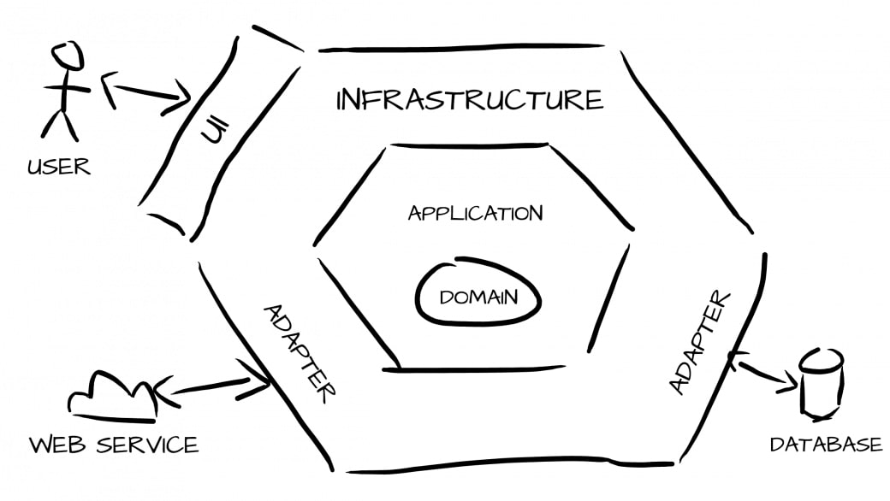

<p align="center">
    
</p>

<h1 align="center">
  🐘🎯 Hexagonal Architecture, DDD & TDD in Symfony
</h1>

<p align="center">
    <a href="https://github.com/dahromy"></a>
    <a href="#"></a>
</p>

<p align="center">
   Example of a <strong>Symfony application using Domain-Driven Design (DDD) and <br /> 
   Test Driver Development (TDD) principles</strong> keeping the code as simple as possible.
  <br />
  <br />
  Take a look, play and have fun with this.
  <a href="https://github.com/dahromy/symfony-hexagonal-architecture/stargazers">Stars are welcome 😊</a>
  <br />
  <br />
  <a href="https://github.com/dahromy/symfony-hexagonal-architecture/issues">Report a bug</a>
  ·
  <a href="https://github.com/dahromy/symfony-hexagonal-architecture/issues">Request a feature</a>
</p>

## 🚀 Environment Setup

This project is made with [Symfony][1] 5.4.

### 🐳 Needed tools

1. PHP 7.4 or higher;
2. Composer
3. PDO-MySQL PHP extension enabled;
4. and the [usual Symfony application requirements][2]. 
5. 4.NodeJS v14.*.
6. Clone this project: `git clone https://github.com/dahromy/symfony-hexagonal-architecture sf-hexa-example`
7. Move to the project folder: `cd sf-hexa-example`

### 🛠️ Environment configuration

1. Create a local environment file (`cp .env .env.local`) if you want to modify any parameter

### 🔥 Application execution

1. Install the backend dependencies: `composer install`.
3. Create database & tables with `php bin/console make:migration` and `php bin/console migration:migrate` or force with `php bin/console d:s:u -f`
5. Install the fronted dependencies: `yarn install` or `npm install`.
6. For the development purpose, run `yarn watch` or `npm run watch`. For the production version, run `yarn build` or `npm run build`.
7. Start the server with Symfony: `symfony serve`.
   Then access the application in your browser at the given URL ([https://localhost:8000](https://localhost:8000) by default).
   If you don't have the Symfony binary installed, run `php -S localhost:8000 -t public/`
   to use the built-in PHP web server or [configure a web server][3] like
   Apache to run the application.

### ✅ Tests execution

1. Install the dependencies if you haven't done it previously: `composer install`
2. Execute PHPUnit and Behat tests: `php bin/phpunit --configuration phpunit.xml.dist`

### 🎯 Hexagonal Architecture

This repository follows the Hexagonal Architecture pattern. Also, it's structured using `modules`.
With this, we can see that the current structure of a Bounded Context is:

```scala
$ tree -L 5 src
    
src
├── Application // The application layer of our app
│   └── Post // Inside the application layer all is structured by actions
│       └── CreatePost
│           ├── CreatePostCommand.php
│           └── CreatePostUseCase.php
├── Domain // The domain layer of our app
│   └── Post
│       ├── Post.php // The Aggregate of the Module
│       └── Services
│           └── PostRepositoryInterface.php // The `Interface` of the repository is inside Domain
├── Infrastructure // The layer infrastructure of our app
│   ├── Controller
│   └── Persistence
│       ├── Doctrine
│       │   └── Post
│       │       ├── PostDoctrineParser.php
│       │       ├── PostDoctrineRepository.php // An implementation of the repository
│       │       └── Post.php
│       ├── InFile
│       │   ├── FilesystemHandler.php
│       │   └── Post
│       │       ├── InFilePostParser.php
│       │       └── InFilePostRepository.php
│       └── InMemory
│           └── Post
│               └── InMemoryPostRepository.php
└── Kernel.php

```

## 🤔 Contributing
There are some things missing (add some features: exception, ui, improve documentation...), feel free to add this if you want! If you want
some guidelines feel free to contact us :)

[1]: https://symfony.com/doc/5.4/index.html
[2]: https://symfony.com/doc/current/setup.html#technical-requirements
[3]: https://symfony.com/doc/current/setup/web_server_configuration.html
